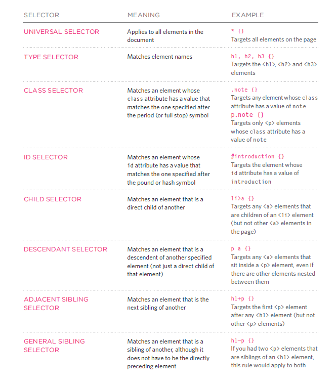

# class-02 summary

## Text notes:
* ***Structural markup*** is using to encode information about the structure of the document.While , ***Semantics markup*** means using tags that add meaning to the content .
* HTML has six "levels" of headings
  - < h1 > is used for main headings
  - < h2 > to < h6 > are used for subheadings.
* < p > To create a paragraph .By default, a browser will show each paragraph on a new line with some space between it and any subsequent paragraphs.
* By enclosing words in the tags < b > and < /b > we can make characters appear bold.
* By enclosing words in the tags < i > and < /i > we can make characters appear italic.
* < sup > element is used to contain characters that should be superscript while < sub > element is used to contain characters that should
be subscript. 
* To add a line break inside the middle of a paragraph you can use the line break tag < br />.
* To add a horizontal rule between sections you can use the < hr /> tag. 
* < strong > element indicates that its content has strong importance.
* < em > element indicates emphasis that subtly changes the meaning of a sentence.
* < blockquote > element is used for longer quotes that take up an entire paragraph while you can use < q > for shorter quotes that sit within a paragraph.
* If you use an abbreviation or an acronym, then the < abbr > element can be used. A title attribute on the opening tag is used to specify the full term.
* To reference a piece of work you can use  < cite > element to indicate where the citation is from.
*  < dfn > element is used to indicate the defining instance of a new term.
* < address > element is used to contain contact details for the author of the page.
* < ins > element can be used to show content that has been inserted into a document, while the < del > element can show text that has been deleted from it.
*  < s > element indicates something that is no longer accurate or relevant (but that should not be deleted).

## Introducing CSS:
* CSS allows you to create rules that specify how the content of an element should appear.
 * Block level elements look like they start on a new line. Examples include the < h1 >-< h6 >, < p > and < div > elements.
 * Inline elements flow within the text and do not start on a new line. Examples include < b >, < i >, < img >, < em > and < span >.
 * CSS works by associating rules with HTML elements. These rules govern how the content of specified elements should be displayed. A CSS rule contains two parts: a ***selector*** and a  ***declaration***.

    

   * Selectors indicate which element the rule applies to.The same rule can apply to more than one element if you separate the element names with commas.
   * Declarations indicate how the elements referred to in the selector should be styled. Declarations are split into two parts (a property and a value), and are separated by a colon.You can specify several properties in one declaration, each separated by a semi-colon.

### CSS rules usually appear in a separate document, although they may appear within an HTML page: 

  * **Using External CSS** by using < link >  element that can be used in an HTML document to tell the browser where to find the CSS file used to style the page. It is an empty element (meaning it does not need a closing tag), and it lives inside the < head > element. It should use three attributes: 
     1. href 
     2. type 
     3. rel
  * **Using Internal CSS** by using < style > to include CSS rules within an HTML page by placing them inside a < style > element, which usually sits inside the < head > element of the page.The < style > element should use the *type* attribute to indicate that the styles are specified in CSS. The value should be text/css.
  * **CSS Selectors**: Different types of selectors allow you to target your rules at different elements.
  
  *  When building a website there are several advantages to placing your CSS rules in a separate style sheet.
     1. Allows all pages to use the same style rules (rather than repeating them in each page).
     2.  Keeps the content separate from how the page looks.
     3. Means you can change the styles used across all pages by altering just one file (rather than each individual page).

  * If you are just creating a single page, you might decide to put the rules in the same file to keep everything in one place.

  ## Basic JavaScript Instructions:
  * Each individual instruction on JavaScript file is known as a ***statement***. Statements should end with a semicolon. 
  * JavaScript is case sensitive.
  * It's important to write comments to explain what your code does and that will help you and others who read the code.
     - Multi-Line comments : starting with the /* characters and ending with the */ characters. 
     - Single-Line comments : starting with //
  * **In JavaScript what is a ***Variable*** ?**
     - A way to programmaticaly reference a previously assigned value .
     - The value stored in a variable can be changed during program execution.
     - A variable is only a name given to a memory location, all the operations done on the variable effects that memory location.
     - In JavaScript, all the variables must be declared before they can be used.
     - 

  * 

  * JavaScript distinguishes between numbers, strings, and true or false values known as Booleans.
  * String is used to store text. In JavaScript, strings are surrounded by quotes:
     - Single quotes: 'Hello'
     - Double quotes: "Hello"
     - Backticks: `Hello`
       * *Note* : Backticks are generally used when you need to include variables or expressions into a string. This is done by wrapping variables or expressions with ${variable or expression}
  * Number represents integer and floating numbers (decimals and exponentials).
  * An **array** is a special type of variable, which can store multiple values using special syntax. Every value is associated with numeric index starting with 0. 
  
  * An array in JavaScript can be defined and initialized in two ways, **array literal** and **Array constructor** syntax.
  * Array literal syntax is simple. It takes a list of values separated by a comma and enclosed in square brackets.
      - Syntax: var < array-name > = [element0, element1, element2,... elementN];
  * JavaScript array can store multiple element of different data types. It is not required to store value of same data type in an array.
  * The Array constructor has following three forms.
    - Syntax: 
          * var arrayName = new Array();

          * var arrayName = new Array(Number length);

          * var arrayName = new Array(element1, element2, element3,... elementN);
  * Array includes length property and various methods to operate on array objects.
  * An expression evaluates into (results in) a single value. Broadly speaking there are two types of expressions. 
     1.  EXPRESSIONS THAT JUST ASSIGN A VALUE TO A VARIABLE 
     2.  EXPRESSIONS THAT USE TWO OR MORE VALUES TO RETURN A SINGLE VALUE
  * Expressions rely on things called operators; they allow programmers to create a single value from one or more values.
     - 
     - String operator: there is just one string operator: the + symbol. It is used to join the strings on either side of it.

## Decisions and Loops:
 Evaluating conditions:
   - You can evaluate a situation by comparing one value in the script to what you expect it might be .
   - The result will be a Boolean :

         1. True 
         2.  False 

+ ( == ) is equal to , it’s compare two values to see if they the same. 

+ ( != ) is not equal to, it’s compare two values to see if they not  the same .

+ (===) strict equal to , it’s compare two values to check that both the datatype and the value are the same .

+ (!==) strict not equal to, it’s compare two values to check that both the datatype and the value are not the same .

+ (>) greater than ,it checks if the number on the left is greater than the number on the right.

+ (<) less than , it checks if the number on the left is less than the number on the right . 

+ ( >=) greater than or equal to, it checks if the number on the left is greater than or equal to the number on the right.

+ (<=) less than or equal to, it checks if the number on the left is less than or equal to the number on the right .

## Logical operators:
 - Comparison operators usually return single values of true or false.While, logical operators allow you to compare the results of more than one comparison operator.
- (&&) logical and, it tests more than one condition.

- (||) logical or , it tests at least one condition.

- ( ! ) logical not , it takes a single boolean value and inverts it .

 

 >  short circuit evaluation: 
 Logical expressions are evaluated left to right .
If the first condition can provide enough information to get the answer, then there is no need to evaluate the second condition.

* ***If statement*** :The if statement evaluates or checks a condition. If the condition evaluates to true any statements in the subsequent code block are executed.Syntax: if(condition expression){
    // code to be executed if condition is true}

* JavaScript includes following forms of if-else conditions:
    * if condition
    * if-else condition
    * else if condition 

## How to Write a Git Commit Message ?
A well-crafted Git commit message is the best way to communicate context about a change to fellow developers (and indeed to their future selves).

* The seven rules of a great Git commit message
  1. Separate subject from body with a blank line.
  2. Limit the subject line to 50 characters
  3. Capitalize the subject line
  4. Do not end the subject line with a period
  5. Use the imperative mood in the subject line
  6. Wrap the body at 72 characters
  7. Use the body to explain what and why vs. how
  

  
