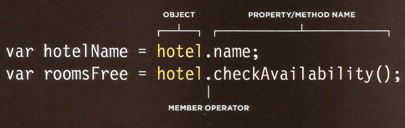

# class-06 summary
## Understanding The Problem Domain Is The Hardest Part Of Programming:
* **What is the hardest thing about writing code?**
 -  The single hardest thing about programming is ***learning the problem domain***.Not Learning a new technology,Naming things,Testing your code,Debugging,Fixing bugs or Making software maintainable ..etc
* **Why problem domains are hard?**
 -  Writing code is a lot like putting together a jigsaw puzzle by putting code with the purpose of building components that which taken out of the “bigger picture” of the problem domain.The big issue is that many problem domains are like a puzzle with a blurry picture or no picture at all.Many of the problem domains that faced programmers are difficult to understand and look completely different depending on various viewpoint and often not given complete information about the problem domain.So, ***programming is easy if you understand the problem domain.***
* **What can you do about it?**
 - You can do one of two things:
   1. ***Make the problem domain easier*** by cutting out cases and narrowing your focus to a particular part of the problem. which means take a part of the problem and fully understand that part before expanding the problem domain.
   2. ***Become better at understanding problem domains*** by understanding a problem inside and out before you try and solve it with code by talking to customers or business people who know about the problem domain. 
##  Object Literals in javaScript
* Objects group together a set of variables and functions to create a model
of a something you would recognize from the real world. In an object,
variables and functions take on new names.
  - Variables >> Properites (tell us about the object).
  - Functions >> Methods (represent tasks that are associated with the object).
* properties and methods have a name and a va lue. In an object, that name is called a ***key*** .
* An object cannot have two keys with the same name. This isbecause keys are usedto access their corresponding values.
* The value of a property can be a string, number, Boolean, array, or even another object.While the value of a method is always a function.
* Programmers use a lot of name/value pairs:
  + HTML uses attribute names and values.
  +  CSS uses property names and values.
  + In JavaScript:
    * Variables have a name and you can assign them a value of a string, number, or Boolean.
    *  Arrays have a name and a group of values. (Each item in an array is a name value pair because it has an index number and a value.)
    *  Named functions have a name and value that is a set of statements to run if the function is called.
    * Objects consist of a set of name/value pairs (but the names are referred to as keys).
* **Literal notation** is the easiest and most popular way to create objects.

* You access the properites or methods of an object using dot notation.You can als access properties using square brackets.

## Document Object Model in JavaScript
* The Document Object Model (DOM) specifies how browsers should create a model of an HTML page and how JavaScript can access and update the contents of a web page while it is in the browser window.The DOM is neither part of HTML, nor part of JavaScript; it is a separate set of rules. It is implemented by all major browser makers.Which ***MAKING A MODEL OF THE HTML PAGE***and ***ACCESSING AND CHANGING THE HTML PAGE***
* The DOM is called an object model because the model (the DOM tree) is made of objects.
* As a browser loads a web page, it creates a model of that page.The model is called a DOM tree, and it is stored in the browsers' memory. It consists of four main types of nodes.
  1. Document nodes (the starting point for all visits to the DOM tree)
  2. Element nodes 
  3. Attribute nodes
  4. Text nodes
* Each node is an object with methods and properties.Scripts access and update this DOM tree (not the source HTML file). Any changes made to the DOM tree are reflected in the browser.

* Accessing and updating the DOM tree involves two steps:
   1. Locate the node that represents the element you want to work with.
   2. Use its text content, child elements, and attributes.
* 
* The terms elements and element nodes are used interchangeably but when people say the DOM is working with an element, it is actually working with a node that represents that element.
* 
* Methods that find elements in the DOM tree are called ***DOM queries***.When you need to work with an element more than once.you should use a variable to store the result of this query.
* DOM queries may return one element, or they may return a Nodelist, which is a collection of nodes.
* METHODS THAT RETURN A SINGLE ELEMENT NODE:
    1. getElementByld('id')
    2. querySelector('css selector')

* METHODS THAT RETURN ONE OR MORE ELEMENTS (AS A NODELIST):
    1. getElementsByClassName('class')
    2. getElementsByTagName('tagName')
    3. querySelectorAll ('css selector')

* There are two ways to select an element from a NodeList : The item() method and array synax. Both require the index number of the element you want .
* When you have a NodeList ,you can loop through each node in the collection and apply the same statement to each .
* When you have an element node, you can select another element in relation to it using these five properties. This is known as traversing the DOM.
    1. parentNode : This property finds the element node for the containing (or parent) element in the HTML.
    2. previousSibling
    3. nextSibling
     * 2 and 3 (These properties find the previous or next sibling of a node if there are siblings.)
    4. firstChild
    5. lastChild
     * 4 and 5 (These properties find the first or last child of the current element.)
* Traversing the DOM can be difficult because some browsers add a text node whenever they come across whitespace between elements.
* When you select a text node, you can retrieve or amend the content of it using the ***nodeVa1ue property***.
* The ***textContent property*** allows you to collect or update just the text that is in the containing element (and its children).
* There are two very different approuches to adding and removing content from a DOM tree : the ***innerHTML property***and ***DOM manipulation***.
* DOM manipulation easily targets individual nodes in the DOM tree,whereas innerHTML is better suited to updating entire fragments.
* Using the i nnerHTML property, you can access and amend the contents of an element, including any child elements.
* DOM manipulation offers another technique to add new content to a page (rather than innerHTML). It involves three steps:

* DOM manipulation can be used to remove elements from the DOM tree.by :
  - Store the element to be removed in  a variable .
  - Store the parent of that element in a variable. 
  - Remove the element from its contaning element. The removeChild() method is used on the containing element that you selected in step 2.
* There are three techniques for adding HTML to a web page you can choose different techniques depending on the task:
 - document.write()
 
 - element.innerHTML
 - DOM MANIPULATION
 
* If you add HTML to a page using i nnerHTML (or several jQuery methods), you need to be aware of Cross-Site Scripting Attacks or XSS; otherwise,an attacker could gain access to your users' accounts.
* Any content generated by users that contain characters that are used in code should be escaped on the server. You must control any markup
added to the page.
* In older browsers, implementation of the DOM is inconsistent (and is a popular reason for using jQuery).
* Modern browsers offer tools for viewing the DOM tree.
