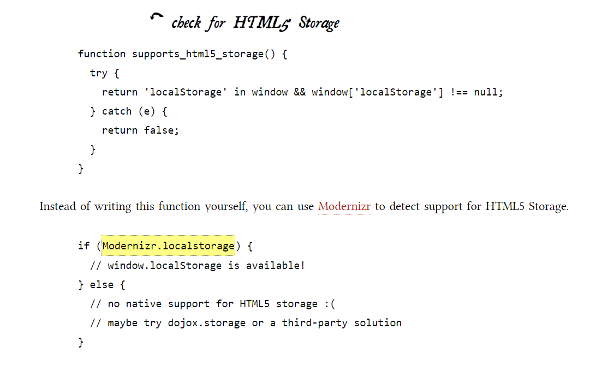
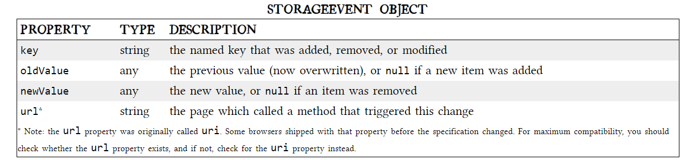

# class-13 summary
## “The Past, Present, and Future of Local Storage for Web Applications”:
* **Persistent local storage** is one of the areas where ***native client applications***"applications that was developed for the computer it is running in" have held an advantage over web applications.For native applications, the operating system typically provides an abstraction layer for storing and retrieving application-specific data like preferences or runtime state. These values may be stored in the registry, INI files, XML files, or some other place according to platform convention.
* If the native client application needs local storage beyond key/value pairs, we can embed our own database, invent our own file format, or any number of other solutions.
* **A brief history of local storage hacks before HTML5** :
* In the beginning, there was only Internet Explorer . It does not present any form of permissions dialog, and there is no allowance for increasing the amount of storage available.
* In 2002, Adobe introduced **A local shared object**, sometimes called a **Flash cookie**.It is a data file that can be created on your computer by the sites you visit.
*  In 2007, Google launched **Gears**, an open source browser plugin aimed at providing additional capabilities in browsers. Gears can store unlimited amounts of data per domain in SQL database tables.
* HTML5 provides a standardized API, implemented natively and consistently in multiple browsers, without having to rely on third-party plugins.
* **Introducing HTML5 storage**:
* What is **HTML5 Storage**? it’s a way for web pages to store named key/value pairs locally, within the client web browser.
* Which browsers? Well, the latest version of pretty much every browser supports HTML5 Storage… even Internet Explorer!
* From your JavaScript code, you’ll access HTML5 Storage through the localStorage object on the global window object. Before you can use it, you should detect whether the browser supports it.

* **Using HTML5 storage** : 
* HTML5 Storage is based on named key/value pairs. You store data based on a named key, then you can retrieve that data with the same key. The named key is a string. The data can be any type supported by JavaScript, including strings, Booleans, integers, or floats. However, the data is actually stored as a string. If you are storing and retrieving anything other than strings, you will need to use functions like **parseInt()** or **parseFloat()** to coerce your retrieved data into the expected JavaScript datatype.
* LocalStorage has four methods: 
  1. localStorage.setItem("data",data)
  2. localStorage.getItem("data")
  3. localStorage.removeItem("data")
  4. localStorage.remove()
* **Tracking chances to the  HTML5 storage area**: 
* If you want to keep track programmatically of when the storage area changes, you can trap the storage event. The storage event is fired on the window object whenever setItem(), removeItem(), or clear() is called and actually changes something.
* The **storage event** is supported everywhere the localStorage object is supported.
* The handle_storage callback function will be called with a StorageEvent object, except in Internet Explorer where the event object is stored in window.event. 
function handle_storage(e) {
  if (!e) { e = window.event; }
}
*  ***StorageEvent object properties.***

* The Indexed Database API exposes what’s called an object store. An object store shares many concepts with a SQL database. There are “databases” with “records,” and each record has a set number of “fields.” Each field has a specific datatype, which is defined when the database is created.
