# class-07 summary
## Domain Modeling
* Domain modeling is the process of creating a conceptual model in code for a specific problem. A model describes the various entities, their attributes and behaviors, as well as the constraints that govern the problem domain. An entity that stores data in properties and encapsulates behaviors in methods is commonly referred to as an **object-oriented model**.

* A domain model that's articulated well can verify and validate the understanding of a specific problem among various stakeholders. As a communication tool, it defines a vocabulary that can be used within and between both technical and business teams.
* Object-Oriented Programming is a way of writing code that allows you to create different objects from a common object. The common object is usually called a blueprint while the created objects are called instances.
* There are four ways to write Object-Oriented Programming in JavaScript. They are:
     1. Using Constructor functions
     2. Using Classes
     3. Using Objects Linking to Other Objects (OLOO)
     4. Using Factory 
* Example : 
```
var EpicFailVideo = function(epicRating, hasAnimals) {
  this.epicRating = epicRating;
  this.hasAnimals = hasAnimals;
}

var parkourFail = new EpicFailVideo(7, false);
var corgiFail = new EpicFailVideo(4, true);

console.log(parkourFail);
console.log(corgiFail);```
```
 - This is object-oriented programming in JavaScript at its most fundamental level.
    + The new keyword instantiates (i.e. creates) an object.
    + The constructor function initializes properties inside that object using the this variable.
    + The object is stored in a variable for later use.
* Here's some tips to follow when building your own domain models.
    + When modeling a single entity that'll have many instances, build self-contained objects with the same attributes and behaviors. 
    + Model its attributes with a constructor function that defines and initializes properties.
    + Model its behaviors with small methods that focus on doing one job well.
    + Create instances using the new keyword followed by a call to a constructor function.
    + Store the newly created object in a variable so you can access its properties and methods from outside.
    + Use the this variable within methods so you can access the object's properties and methods from inside.
## Tables in HTML
* **What's a Table?** Simply ,the table is grid made up of rows and columns (a bit like a spreadsheet).Which represents information in a grid format.
* **Basic Table Structure**
 

  * The < table > element is used to create a table. The contents of the table are written out row by row.
  * < tr >"  table row "the start of each row .It is followed by one or more < td > elements"table data" (one for each cell in that row).
  * The < th >"table heading" element is used to represent the heading for either a column or a row. 

* You can use the scope attribute on the < th > element to indicate whether it is a heading for a column or a row. It can take the values: row to indicate a heading for a row or col to indicate a heading for a column.
* For long tables There are three elements that help distinguish between the main content of the table and the first and last rows (which can contain different content): 
   1. < thead > The headings of the table should sit inside this element.
   2. < tbody > The body should sit inside this element.
   3. < tfoot > The footer belongs inside this element.

## JS Functions, Methods, and Objects:
* Creating an object using constructor notation: 
 - The ***new*** keyword and the object constructor create a block object.You can then add properties and methods to the object.like so:
 ```const user = new Object(); 
user.name = 'Jannet'; 
school.location = 'Nigeria'; 
school.age = 34; 

user.displayInfo = function(){ 
    console.log(`My ${user.name} i live in  
          in ${user.location} and am ${user.age} years old`); 
};
user.displayInfo();
//Output: ```
```
* To update the value of properties , use **dot notation**or **square brackets** .They work on objects created using literal or constructor notation.To delete a property,use the ***delete keyword***.
* Sometimes you will want several objects to represent similar things.Object constructors can use a function as a templete for creating objects.
first create the template with the object's properties and methods.
 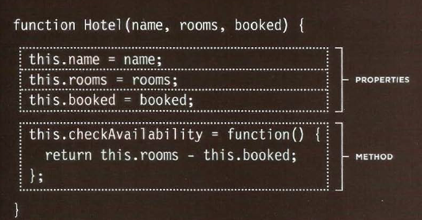
* You create instances of the object using the constructor function.The new keyword followed by a call of the function creates a new object.The properties of each object are given as arguments to the function.
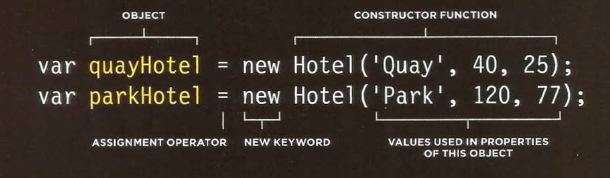

* **WAYS TO CREATE OBJECTS**:
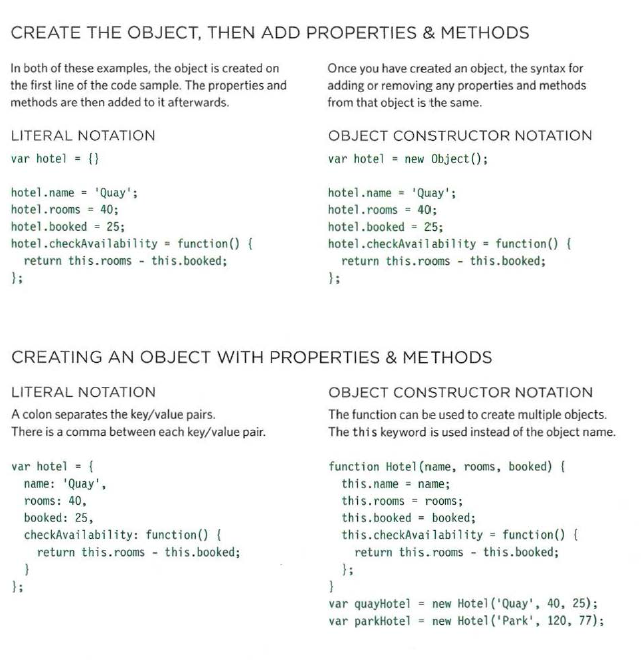

* The keyword ***this*** is commonly used inside functions and objects. Where the function is declared alters what this means. It always refers to one object, usually the object in which the function operates.
* When  object is used inside a function in the **global context** it refers to the **window object**.
* In JavaScript, data is represented using name/value pairs .To organize your data, you can use an array or object to group a set of
related values. In arrays and objects the name is also known as a ***key***.
* If you want to access items via a property name or key, use an object (but note that each key in the object must be unique).
If the order of the items is important, use an array.
* Arrays are actually a special type of object.They hold a related set of key/value pairs (like all objects) ,but the key for each value is its index number.
* You can combine arrays and objects to create complex data structures:Array can store a series of objects (and remember their order) which written using the object literal syntax.Also,Objects can hold arrays (as values of their properties).

* Browsers come with a set of ***built-in objects*** that represent things like the browser window and the current web page shown in that window. These
built-in objects act like a toolkit for creating interactive web pages.
 1. **BROWSER OBJECT MODEL** : contain objects that represent the current browser window or tab. It contains objects that model things like browser history and the device's screen.
 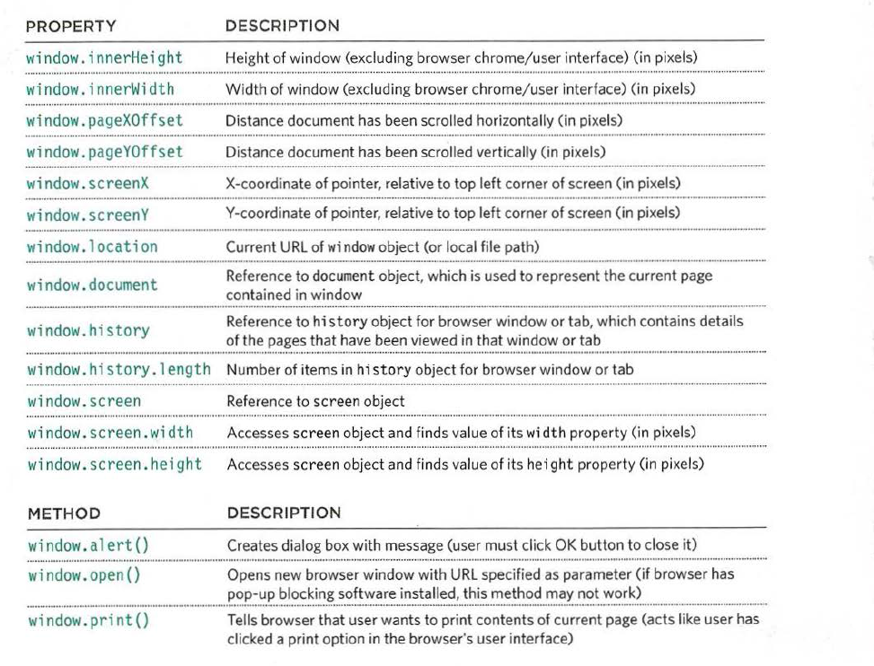 
 
 2. **DOCUMENT OBJECT MODEL** : uses objects to create a representation of the current page. It creates a new object for each element (and each individual section of text) within the page.
 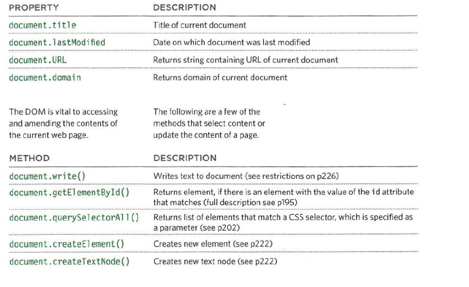
 3. **GLOBAL JAVASCRIPT OBJECTS** : represent things that the JavaScript language needs to create a model of. For example, there is an object that deals only with dates and times.
 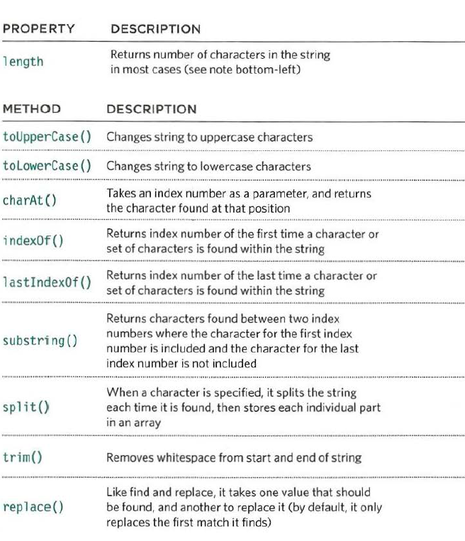
* Each character in a string is automatically given a number, called an ***index number***. Index numbers always start at zero and not one (just like for items in an array).
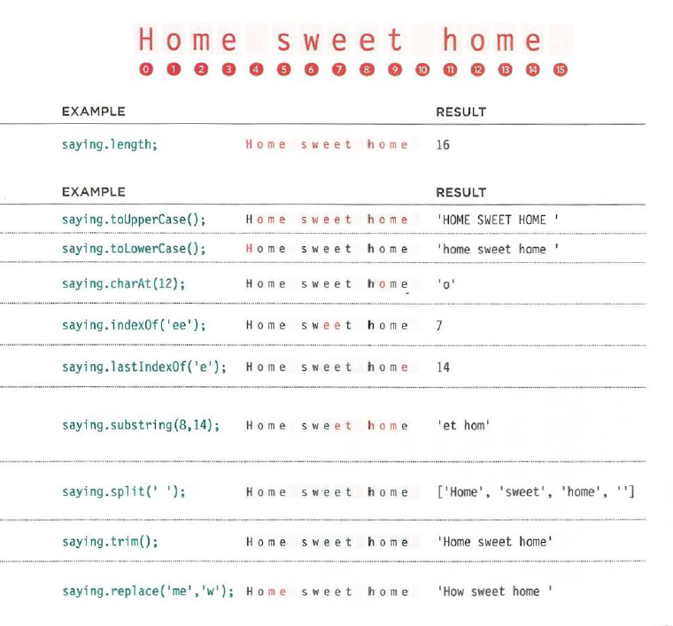
* In JavaScript there are six data types: Five of them are described as simple (or primitive) data types (**String** / **Number**/ **Boolean**/**Undefined** (a variable that has been declared, but no value has been assigned to it yet) and **Null** (a variable with no value - it may have had one at some point, but no longer has a value)). The sixth is the **object** (and is referred to as a complex data type).
* **GLOBAL OBJECTS: NUMBER OBJECT**: Whenever you have a value that is a number, you can use the methods and properties of the Number object on it.
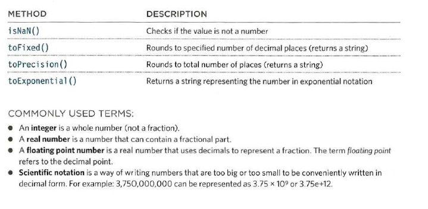

* **GLOBAL OBJECTS: MATH OBJECT** The Math object has properties and methods for mathematical constants and functions.
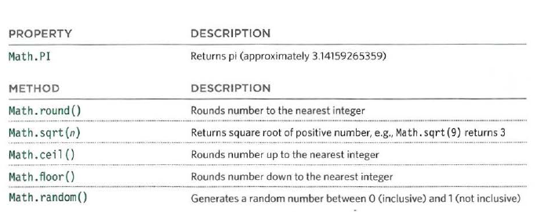
* **GLOBAL OBJECTS:DATE OBJECT (AND TIME)** Once you have created a Date object, the following methods let you set
and retrieve the time and date that it represents.
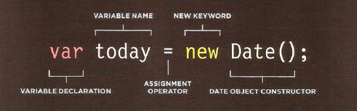
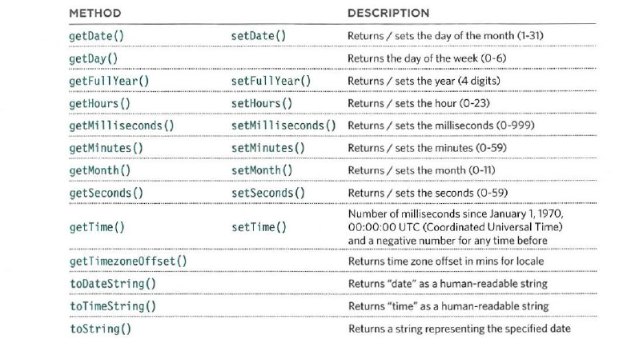


