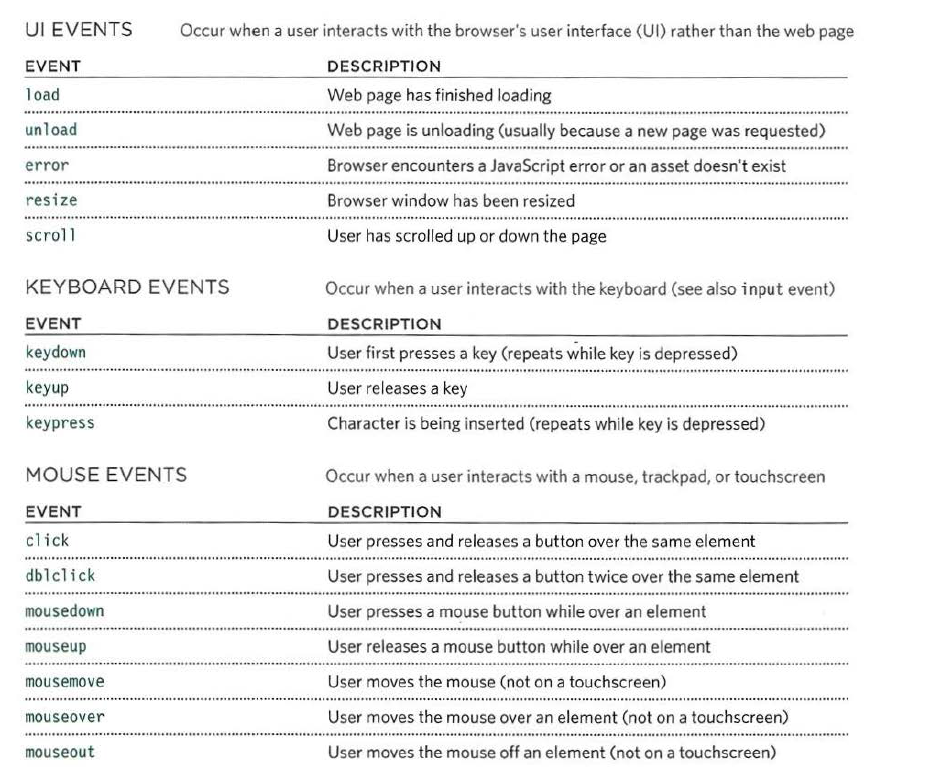
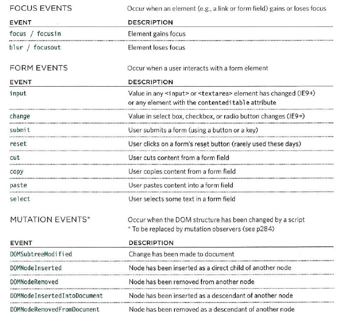
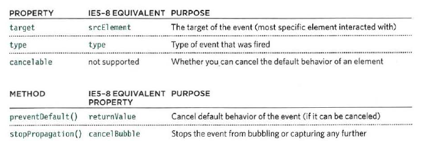
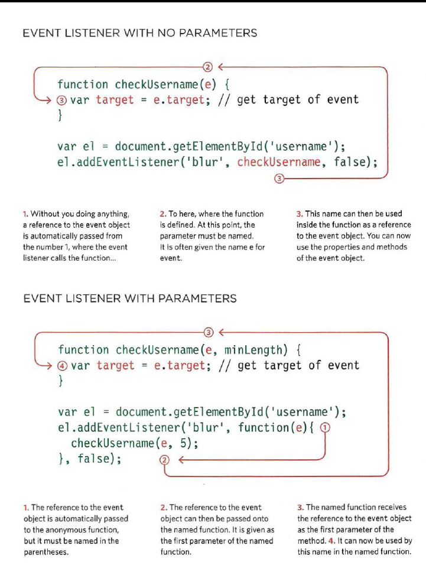
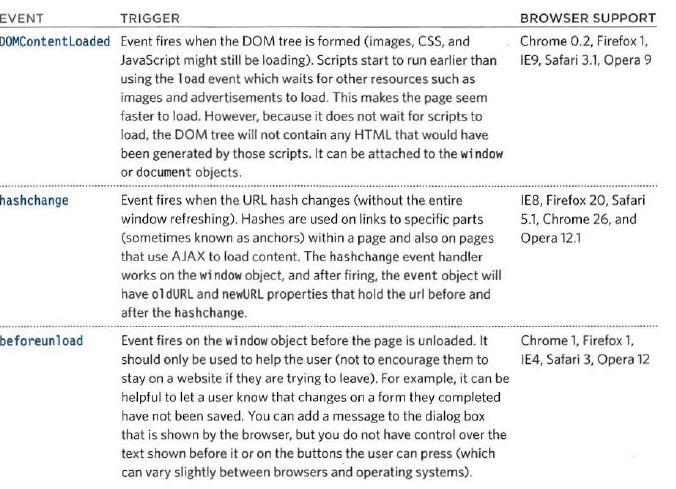

# class-09 summary
## HTML forms
* The term "form" indicates to a printed document that contains Spaces for you to fill in the information.
* Form in HTML indicates to different elements that allow you to collect and store information "such as username, password, contact number, email id etc" from visitors(users) to your site using interactive controls .
* The best known form on the web is probably the search box that sits right in the middle of Google's homepage.
* Information from a form is sent in name/value pairs.
* There are several types of form controls You can use it to collect information from your visitors for your site. 
 1.  **Adding Text** : Text input(single-line such as email addresses and names)/passward input(single line text box but it masks the characters entered)/Text area(multi-line such as messages and comments.).
 2. **Making choices** : Radio buttons( to select one of a number of options)/Checkboxes(to select and unselect one or more options)/ Drop-down boxes (to pick one of a number of options from a list).
 3. **Submitting Forms** :  Submit buttons (to submit data from your form to another web page)/ Image buttons( Similar to submit buttons but they allow you to use an image
 4. **Uploading files** : File upload (Allows users to upload files (e.g. images) to a website).

* A form may have several form controls, each gathering different information. The server needs to know which piece of inputted data corresponds with which form element.
* Form controls live inside a < form > element. This element should always carry the *action* attribute and will usually have a *method* and *id* attribute too.
  - Action attribute:  Its value is the URL for the page on the server that will receive the information in the form when it is submitted.
  - Method : Forms can be sent using one of two methods: *get* or *post*. 
  - Id attribute : used to identify the form distinctly from other elements on the page.
* GET and POST access methods are defined in the HTTP protocol and included in the HTML specification. The choice of method depends on how the data is received, the size and nature of the data.

* **Text input** : by using the < input > element, type attribute has a value of text,name attribute with value identifies the form control and is sent along with the information the user enter to the server,size attribute to indicate the width of the text input (measured by the number of characters that would be seen) and maxlength attribute to limit the number of characters a user may enter into the text field.
* **Password Input** : like the text input but with type attribute value of password.
* **Text area** : by using < textarea > element to create a mutli-line text input.The cols and rows attributes used with this element.The cols attribute indicates how wide the text area should be (measured in numbers of characters). The rows attribute indicates how many rows the text area should take up vertically.
* **Radio button** : by using < input > element,type attribute has a value of radio, name attribute ,value attribute which indicates the value that is sent to the server for the selected option and checked attribute which indicates which value (if any) should be selected when the page loads. The value of this attribute is checked.
* **check box** : like the radio button but with type attribute value of checkbox.
* **Drop-down boxes**: by using < select > element to create a drop down list box. It contains two or more < option > elements , name attribute indicates the name of the form control being sent to the server, along with the value the user selected.The < option > element used to specify the options that the user can select from.The words between the opening < option > and closing </ option > tags will be shown to the user in the drop down box.The < option > element uses the value attribute to indicate the value that is sent to the server along with the name of the control if this option is selected.Also,The selected attribute can be used to indicate the option that should be selected when the page loads. The value of this attribute should be selected.
* **Multiple Select Box**: You can turn a drop down select box into a box that shows more than one option by adding the size attribute. Its value should be the number of options you want to show at once.You can allow users to select multiple options from this list by adding the multiple attribute with a value of multiple.
* **File Input Box**: by using < input > element with type attribute has a value of file .
* **Submit button** : by using < input > element with type attribute has a value of submit,name attribute but it does not need to have one and  value attribute to control the text that appears on a button. 
* **Image button** : by using < input > element with type attribute has a value of image and The src, width, height, and alt attributes work just like they do when used with the < img > element 
* **Button and hidden controls** : 
   - The < button > element allow users more control over how their buttons appear, and to allow other elements to appear inside the button.For example : you can combine text and images between the opening < button > tag and closing < /button > tag.
   - Hidden controls by using < input > element with type has a value of hidden which allow web page authors to add values to forms that users cannot see.
* **Labelling Form Controls** : A < label > is used to create a caption for a form control. The < label > can be associated with a form control either implicitly by placing the control element inside the label element, or explicitly by using the forattribute. To explicitly associate a label with a form control, include the for attribute in the label using the id of the form control as the for attribute’s value. For improved accessibility, always include a < label > for every form control.
* **Grouping Form Elements** : You can group related form controls together inside the < fieldset > element. This is particularly helpful for longer forms.The < legend > element can come directly after the opening < fieldset > tag and contains a caption which helps identify the purpose of that group of form controls.
* HTML5 introduces new form elements which make it easier for visitors to fill in forms.
  1. Date Input
  2. Email & URL Input
  3. Search Input

## Lists, Tables & Forms:
#### Bullent point styles:
* The list-style-type property specifies the type of list item marker. Default value is "disc"
* .png)
*  The list-style-image property replaces the list-item marker with an image.
* The list-style-position property specifies the position of the list-item markers (bullet points).
  1. list-style-position: outside; means that the bullet points will be outside the list item. The start of each line of a list item will be aligned vertically.
  2. list-style-position: inside; means that the bullet points will be inside the list item. As it is part of the list item, it will be part of the text and push the text at the start.
* The list-style allows to express the markers' style, image and position properties in any order.

#### Table Properties:
* **width** to set the width of the table.
* **padding** to set the space between the border of each table cell and its content
* **text-transform** to convert the content of the table headers to uppercase.
* **letter-spacing, font-size** to add additional styling to the content of the table headers.
* **border-top, border-bottom** to set borders above and below the table headers.
* **text-align** to align the writing to the left of some table cells and to the right of the others
* **background-color** to change the background color of the alternating table rows
* **:hover** to highlight a table row when a user's mouse goes over it.
*  **empty-cells** specifies whether the border should be shown if a cell is empty.This property can have one of the three values - show, hide or inherit.
* **The border-collapse** specifies whether the browser should control the appearance of the adjacent borders that touch each other or whether each cell should maintain its style.
* **The border-spacing** specifies the width that should appear between table cells. 
#### Styling Forms:
* ***Styling Text Input*** :
  - **font-size** sets the size of the text entered by the user.
  - **color** sets the text color, and **background-color** sets the background color of the input.
  - **border** adds a border around the edge of the input box, and **border-radius** can be used to create rounded corners (for browsers that support this property). 
  - **The :focus** pseudo-class is used to change the background color of the text input when it is being used, and **the :hover** psuedo-class applies the same styles when the user hovers over them.
  - **background-image** adds a background image to the box.
* ***Styling Submit Buttons***
  - **text-shadow** can give a 3D look to the text in browsers that support this property.
  - **border-bottom** to make the bottom border of the button slightly thicker, which gives it a more 3D feel.
* ***Styling Fieldsets & Legends***:Fieldsets are particularly helpful in determining the edges of a form. In a long form they can help group together related information within it. The legend is used to indicate what information is required in the fieldset.
  - Properties commonly used with these two elements include:width/color/background-color/border/border-radius / padding.
* ***Cursor styles***: The cursor property allows you to control the type of mouse cursor that should be displayed to users.
  - the most commonly used values for this property: auto /crosshair /default/ pointer / move / text / wait / help / url("cursor.gif");
* Web Developer Toolbar is helpful extension for Firefox and Chrome provides tools to show you the CSS styles that apply to an element when you hover over it,along with the structure of the HTML.

## JS Events:
* When you browse the web, your browser registers different types of events which tells your script about so it can respond to them in some way if desired.
* Any of these events can be used to trigger a function in your JavaScript code:

* When an event has occurred, it is often described as having **fired** or been **raised**.So it could **trigger** a particular function in the script.

* When the user interacts with the HTML on a web page, there are three steps involved in getting it to trigger some JavaScript code. Together these steps are known as **event handling**:
  1. Select t he element node(s) you want the script to respond to.
  2. Indicate which event on the selected node(s) will trigger the response.
  3. State the code you want to run when the event occurs.
* Event handlers let you indicate which event you are waiting for on any particular element. There are three types of event handlers.
  1. Inline/HTML Event Handlers : This is bad-practice, but since you see it in older browsers, you need to be aware of it. This method is no longer in use; it is always better to separate the JavaScript from the HTML. The attribute name matches the event names; their value calls the function linked to that event. The syntax to recognize an HTML event handler looks like this: < element attribute = “functionName()” >.
  2. Traditional DOM Event Handlers :  DOM event handlers, introduced in the original specification for the DOM, is an alternative to add an event handler to any element. This method separates JavaScript from the HTML, thus is preferred over Inline event handlers. All the major browsers support this approach. The drawback is that for any event, you can attach only one function. As a result, if a page uses more than one script, and both scripts respond to the same event, then one or both of the scripts may not work as intended.The syntax of adding an event is something like this: element.onevent = functionName;
  3. DOM LEVEL 2 EVENT LISTENERS: Unlike traditional DOM event handlers, these allow a single event to trigger multiple functions. Thus, there are fewer conflicts between the multiple scripts that run on the same page. This technique doesn’t work with the IE8 or earlier IE versions. These differences in browser support are resolved by using jQuery.
   - You can add an event listener to your event with this syntax: element.addEventListener(“event”, functionName [, Boolean]);
   - Or you can remove the event listener by using this syntax : element.removeEventListener(“event”, functionName [, Boolean]);
   By default, the value of Boolean is set to false, for event capturing. You can set the value to true if you want to change the event flow.
* Because you cannot have parentheses after the function names in event handlers or listeners, passing arguments requires a workaround. To remedy that, we use **anonymous functions** i.e., functions with no name. Since parenthesis follows the function call (to pass the arguments), the code runs immediately. We wrap the function call in an anonymous function so it only runs when the event triggers it. The syntax of this approach is as follows: element.addEventListener(“event”, function(){ functionCall(parameters); }, Boolean);
* IES-8 had a different event model and did not support addEventL i stener() but you can provide fallback code to make event listeners work with older versions of IE.
* HTML elements nest inside other elements .If you hover or click on a link you will also be hovering or clicking on its parent elements.
* A stage in an event flow is called **event bubbling** if the event starts at the most specific element(the deepest possible node in the DOM) and then flows upward towards the least specific node(i.e the document).

* An alternative event flow model is called Event Capturing , first introduced by Netscape Browser.

* The flow of events only really matters when your code has event handlers on an element and one of its ancestor or descendant elements.
* When an event occurs, the event object tells you information about the event, and the element it happened upon.

* The event object has methods that change: the default behavior of an element and how the element's ancestors respond to the event.
  * preventDefau1t ()
  * stopPropagation()
* The event object can tell you where the cursor was positioned when an event was triggered.
* Here are three page-level events that have been included in versions of the HTMLS spec that have become popular very quickly.

