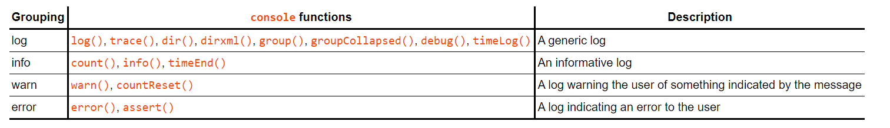

# class-10 summary
## Error Handling & Debugging
* Errors, bugs, and therefore debugging are a part of life for a programmer. As the saying goes, if you haven’t made any mistakes, then you aren’t trying hard enough.
* To find the source of an error, it helps to know how scripts are processed.The order in which statements are executed can be complex; some tasks cannot complete until another statement or function has been run.
* **The order of execution** is the order in which lines of code are executed or run.
* The JavaScript interpreter uses the concept of **execution contexts**. There is one global execution context; plus, each function creates a new new execution context. They correspond to **variable scope**.
* Every function invocation has both a scope and a context associated with it. Fundamentally, scope is function-based while context is object-based. In other words, scope pertains to the variable access of a function when it is invoked and is unique to each invocation. Context is always the value of the this keyword, which is a reference to the object that “owns” the currently executing code.
* **The stack** : The JavaScript interpreter processes one line of code at a time.When a statment needs data from another function,it stacks or pilies the new function on top of the current task.
* Each time a script enters a new execution context, there are two phases of activity:
 1. prepare (The new scope is created,variables, functions, and arguments are created and the value of the this keyword is determined)
 2. Excute( assign values to variables ,reference functions and run their code and execute statements.
* The preparation phase is often described as taking all of the variables and functions and **hoisting** them to the top of the execution context. Or you can think of them as having been prepared.
* In the interpreter, each execution context has its own variables object. It holds the variables, functions, and parameters available within it. Each execution context can also access its parent's **variables object**
* **lexical scope**: means that a variable defined outside a function can be accessible inside another function defined after the variable declaration. But the opposite is not true; the variables defined inside a function will not be accessible outside that function.
* If a JavaScript statement generates an error, then it throws an **exception**.At that point, the interpreter stops and looks for exception-handling code.
* Error objects can help you find where your mistakes are and browsers have tools to help you read them.
* JavaScript gives us 8 error objects, which are raised in a try/catch expression depending on the error type: Error/EvalError/ RangeError/ReferenceError/SyntaxError/TypeError/URIErro.
* When an Error object is created, it will contain the following properties: *name*: Type of execution/ *message* Description / *fileNumber* :Name of the JavaScript file /*lineNumber*: Line number of error.
* **Syntax errors** "SYNTAX IS NOT CORRECT" This is caused by incorrect use of the rules of the language. It is often the result of a simple typo.
* **ReferenceError** "VARIABLE DOES NOT EXIST" This is caused by a variable that is not declared or is out of scope.
* **EvalError** "INCORRECT USE OF eval() FUNCTION" The eva l () function evaluates text through the interpreter and runs it as code.
* **URI Error** "INCORRECT USE OF URI FUNCTIONS" If these characters are not escaped in URls, they will cause an error: / ? & I : ;
* **Type Error** "VALUE IS UNEXPECTED DATA TYPE" This is often caused by trying to use an object or method that does not exist.
* **RangeError**" NUMBER OUTSIDE OF RANGE" If you call a function using numbers outside of its accepted range.
* **Error**" GENERIC ERROR OBJECT" The generic Error object is the template (orprototype) from which all other error objects are created.
* *How to deal with errors ?*
  1. DEBUG THE SCRIPT TO FIX ERRORS
  2.  HANDLE ERRORS GRACEFULLY You can handle errors gracefully using try, catch, throw, and finally statements.
* **Debugging**is about deduction: eliminating potential causes of an error.
* To find out where the problem is, you can check:
   1. The error message The line number The type of error
   2. How far the script has run
   3. Values in code by setting breakpoints and comparing the values you expect to what the variables hold.
* All modern browsers have developer tools to help you debug scripts. Start by opening the JavaScript console.
* The console will show you when there is an error in your JavaScript. It also displays the line where it became a problem for the interpreter.You can also just type code into the console and it will show you a result.
* Browsers that have a console have a console object, which has several methods that your script can use to display data in the console. The object is documented in the Console API. 
* Each console function uses a unique value for the logLevel parameter when calling Printer, allowing implementations to customize each printed message depending on the function from which it originated. However, it is common practice to group together certain functions and treat their output similarly, in four broad categories. This table summarizes these common groupings:

* You can pause the execution of a script on any line using breakpoints. Then you can check the values stored in variables at that point in time.
* If you know your code might fail, use try, catch, and finally.Each one is given its own code block.

* If you know something might cause a problem for your script, you can generate your own errors before the interpreter creates them. To create your own error, you use the following line: throw new Error('message');This creates a new Error object (using the default Error object). The parameter is the message you want associated with the error. This message should be as descriptive as possible. 
* Common errors sources : 
  1. MISSED/ EXTRA CHARACTERS.
  2. DATA TYPE ISSUES.
  3. CASE ERRORS
