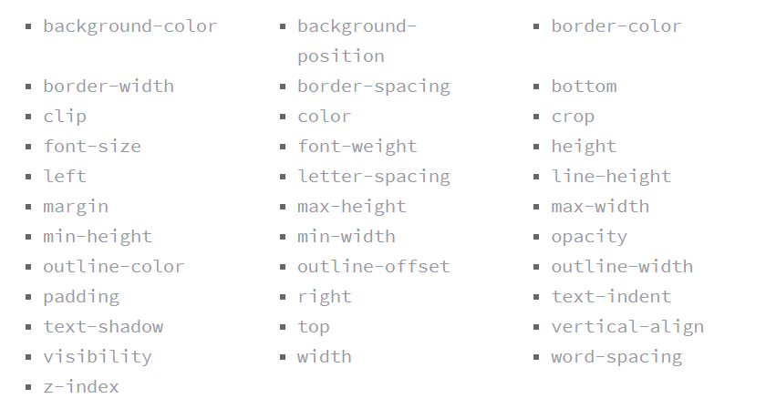

# class-14A summary
## CSS Transforms :
* ***The CSS3 transform property*** comes in two different settings, two-dimensional and three-dimensional. Each of these come with their own individual properties and values.
* The actual syntax for the transform property is quite simple, including the transform property followed by the value. The value specifies the transform type followed by a specific amount inside parentheses.
* Elements may be distorted, or transformed, on both a two-dimensional plane or a three-dimensional plane. Two-dimensional transforms work on the x and y axes, known as horizontal and vertical axes. Three-dimensional transforms work on both the x and y axes, as well as the z axis. These three-dimensional transforms help define not only the length and width of an element, but also the depth. 
* **2D Rotate** : The transform property accepts a handful of different values. The rotate value provides the ability to rotate an element from **0 to 360 degrees**. Using a *positive value will rotate an element clockwise*, and using a *negative value will rotate the element counterclockwise*. The default point of rotation is the center of the element, 50% 50%, both horizontally and vertically. 
* **2D Scale** : Using the scale value within the transform property allows you to change the appeared size of an element. The default scale value is 1, therefore any value between .99 and .01 makes an element appear smaller while any value greater than or equal to 1.01 makes an element appear larger.
* **Note** : It is possible to scale only the height or width of an element using the scaleX and scaleY values. The scaleX value will scale the width of an element while the scaleY value will scale the height of an element. To scale both the height and width of an element but at different sizes, the x and y axis values may be set simultaneously. To do so, use the scale transform declaring the x axis value first, followed by a comma, and then the y axis value.
* **2D Translate** The translate value works a bit like that of relative positioning, pushing and pulling an element in different directions without interrupting the normal flow of the document. Using the **translateX**value will change the position of an element on the horizontal axis while using the **translateY** value will change the position of an element on the vertical axis.
* The distance values used within the translate value may be any general length measurement, most commonly **pixels or percentages**. 
 - Positive values will push an element down and to the right of its default position .
 - negative values will pull an element up and to the left of its default position.
* **skew** is used to distort elements on the horizontal axis, vertical axis, or both. 
 -  Using the skewX value distorts an element on the horizontal axis .
 -  Using the skewY value distorts an element on the vertical axis. 
 To distort an element on both axes the skew value is used, declaring the x axis value first, followed by a comma, and then the y axis value.The distance calculation of the skew value is measured in units of degrees. Length measurements, such as pixels or percentages, do not apply here.
* To combine transforms, list the transform values within the transform property one after the other without the use of commas.
* In 3D transforms ,the perspective of an element can be set in two different ways. One way includes using the perspective value within the transform property on individual elements, while the other includes using the perspective property on the parent element residing over child elements being transformed.
* The perspective value can be set as none or a length measurement. The none value turns off any perspective, while the length value will set the depth of the perspective.
*  Using three-dimensional transforms we can change elements on the z axis, giving us control of **depth** as well as length and width.
* **3D Rotate**  With three-dimensional transforms we can rotate an element around any axes. To do so, we use three new transform values, including rotateX, rotateY, and rotateZ.As with the general rotate value before, positive values will rotate the element around its dedicated axis clockwise, while negative values will rotate the element counterclockwise.
* Elements may also be translated on the z axis using the translateZ value. A negative value here will push an element further away on the z axis, resulting in a smaller element. Using a positive value will pull an element closer on the z axis, resulting in a larger element.
* Skew is the one two-dimensional transform that cannot be transformed on a three-dimensional scale.
* The **transform-style property** needs to be placed on the parent element, above any nested transforms. The **preserve-3d value** allows the transformed children elements to appear in their own three-dimensional plane while the **flat value** forces the transformed children elements to lie flat on the two-dimensional plane.
* The **backface-visibility property** defines whether or not the back face of an element should be visible when facing the user.The back face of an element is a mirror image of the front face being displayed.This property is useful when an element is rotated. It lets you choose if the user should see the back face or not.

## Transitions & Animations:
* With CSS3 transitions you have the potential to alter the appearance and behavior of an element whenever a state change occurs, such as when it is hovered over, focused on, active, or targeted.
* Animations within CSS3 allow the appearance and behavior of an element to be altered in multiple keyframes. Transitions provide a change from one state to another, while animations can set multiple points of transition upon different keyframes.
* he easiest way for determining styles for different states is by using the :hover, :focus, :active, and :target pseudo-classes.
* There are four transition related properties in total, including **transition-property**, **transition-duration**, **transition-timing-function**, and **transition-delay**. Not all of these are required to build a transition, with the first three are the most popular.
* The transition-property property determines exactly what properties will be altered in conjunction with the other transitional properties. By default, all of the properties within an element’s different states will be altered upon change. However, only the properties identified within the transition-property value will be affected by any transitions.If multiple properties need to be transitioned they may be comma separated within the transition-property value. Additionally, the keyword value all may be used to transition all properties of an element.
* A handful of the more popular transitional properties include the following:

* The duration in which a transition takes place is set using the transition-duration property. The value of this property can be set using general timing values, including seconds (s) and milliseconds (ms). These timing values may also come in fractional measurements, .2s for example.
* The transition-timing-function property is used to set the speed in which a transition will move.A few of the more popular keyword values for the transition-timing-function property include **linear**, **ease-in**, **ease-out**, and **ease-in-out**.
  - The linear keyword value identifies a transition moving in a constant speed from one state to another. 
  - The ease-in value identifies a transition that starts slowly and speeds up throughout the transition 
  - The ease-out value identifies a transition that starts quickly and slows down throughout the transition.
  -  The ease-in-out value identifies a transition that starts slowly, speeds up in the middle, then slows down again before ending.
* To set multiple points at which an element should undergo a transition, use the **@keyframes rule**. The @keyframes rule includes the animation name, any animation breakpoints, and the properties intended to be animated.
* The animation-name property is used with the animation name, identified from the @keyframes rule, as the property value. The animation-name declaration is applied to the element in which the animation is to be applied to.
* Using the animation-name property alone isn’t enough though. You also need to declare an animation-duration property and value so that the browser knows how long an animation should take to complete. the duration may be set in seconds or milliseconds.
* By default, animations run their cycle once from beginning to end and then stop. To have an animation repeat itself numerous times the **animation-iteration-count property** may be used. Values for the animation-iteration-count property include either an integer or the infinite keyword. 
* To declare the direction use the **animation-direction property**. Values for the animation-direction property include normal, reverse, alternate, and alternate-reverse.
* **The animation-play-state property** allows an animation to be played or paused using the running and paused keyword values respectively.
* **The animation-fill-mode property** identifies how an element should be styled either before, after, or before and after an animation is run. The animation-fill-mode property accepts four keyword values, including none, forwards, backwards, and both.

## 8 simple CSS3 transitions that will wow your users :
* 1. **Fade in**  Having things fade in is a fairly common request from clients. It’s a great way to emphasize functionality or draw attention to a call to action. Fade in effects are coded in two steps: first, you set the initial state; next, you set the change, for example on hover:

* 2. **Change color**
* 3. **Grow & Shrink section**
* 4. **Rotate elements**
* 5. **Square to circle** : transitioning a square element into a round one, and vice versa. Using CSS border-radius property.
* 6. **3D shadow**
* 7. **Swing** : using @keyframes, animation and animation-iteration.
* 8. **Inset border** 

